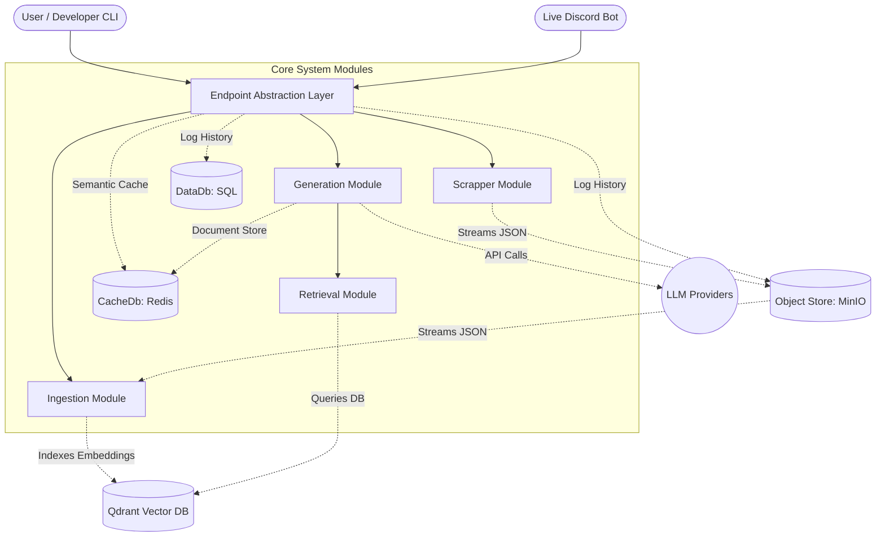
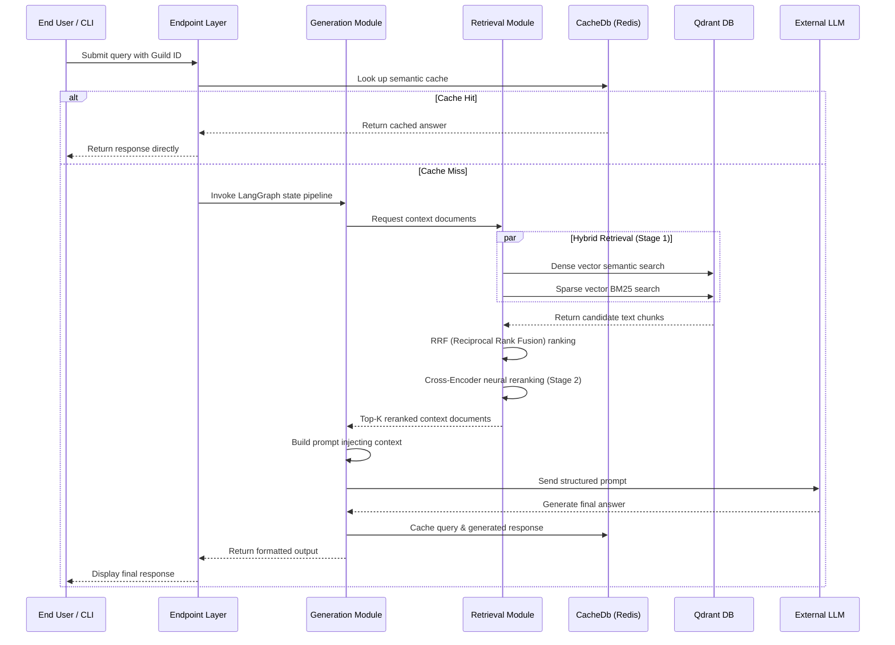

# Discos | Discord RAG System

[](https://www.python.org/downloads/)
[](https://discord.com)
[](https://qdrant.tech)
[](https://min.io)
[](https://redis.io)
[](LICENSE)

**Discos** is a RAG (Retrieval-Augmented Generation) system for Discord. It scrapes channel history, indexes it into a vector database, and lets you query your server's logs using a Discord bot.

Storage, caching, vector search, and LLM inference are abstracted behind interfaces, making it easy to swap or upgrade components independently.

## Features

* **Object Store Pipeline**: The `Scrapper` streams raw Discord exports directly to an Object Store (MinIO/S3) as structured JSON. The `Ingestion` pipeline reads from the same store to build the vector index.
* **Two-Stage Hybrid Retrieval**:
  * **Stage 1**: Runs dense vector (SentenceTransformers) and sparse (BM25) searches concurrently, merging results using Reciprocal Rank Fusion (RRF).
  * **Stage 2**: Reranks results using a Cross-Encoder transformer model for semantic relevance.
* **Multi-Guild Tenancy**: Uses dedicated Qdrant collections and object store prefixes per guild to keep data isolated.
* **LangGraph Workflows**: Generation tasks are managed via typed `StateGraph` machines for structured execution.
* **Multi-Provider LLM Support**: Supports OpenAI, Anthropic, Gemini, Groq, and local Ollama models via a unified interface.
* **Semantic Response Cache**: Caches query responses in Redis to speed up repeated questions.
* **Conversation Logs**: Logs queries and responses as JSON to the object store and records history in a SQL database.
* **Provider-Agnostic Abstractions**: Core services (`objectStore`, `CacheDb`, `DataDb`) use interface factories to easily swap backends.
* **Discord Bot UI**: Built on `discord.py`'s `commands.Cog` framework, offering interactive buttons and select menus.

## Architecture

Discos is divided into separate modules for data scraping, ingestion, retrieval, caching, generation, and the Discord frontend.

### System Architecture Diagram



### Data Pipeline and Workflows

#### 1. Ingestion Workflow

The data ingestion pipeline converts raw Discord exports into optimized vectors:

1. **Extraction**: The `Scrapper` module streams server chat channels, metadata, and message logs directly to the `objectStore` in JSON format.
2. **Text Chunking**: The `Ingestion` module runs sliding window chunking to split long discussions while preserving context overlaps.
3. **Multi-Vector Generation**: Generates dense embeddings using SentenceTransformers and calculates sparse BM25 vectors.
4. **Index Isolation**: Records are written into dedicated Qdrant collections, strictly segregated by Guild ID to prevent data leakage.

#### 2. Query and Retrieval Sequence

When a query is received by the Discord Bot App or developer CLI, the following sequence is executed:



## Installation

### 1. Prerequisites

- Python 3.10+
* **Redis Server** (for caching & LangGraph state)
* **Qdrant Vector DB** (for semantic search)
* **MinIO / S3 Object Store** (for raw data & chat logs)
* **SQL / NoSQL DB** (SQLite, PostgreSQL, MySQL, or MongoDB)

### 2. Spinning Up Local Services (Docker)

You can quickly run the required services locally using Docker:

```bash
# Qdrant
docker run -d -p 6333:6333 -p 6334:6334 --name qdrant qdrant/qdrant

# Redis
docker run -d -p 6379:6379 --name redis redis:alpine

# MinIO (credentials match configuration in .env)
docker run -d -p 9000:9000 -p 9001:9001 --name minio \
  -e "MINIO_ROOT_USER=minioadmin" \
  -e "MINIO_ROOT_PASSWORD=minioadmin" \
  minio/minio server /data --console-address ":9001"
```

### 3. Clone and Install

```bash
git clone <repository_url>
cd Discos
pip install -r requirements.txt
```

## Configuration

Create a `.env` file in the project root:

```env
# Discord Bot Credentials
DISCORD_TOKEN=""

# Generation Model Providers (Set the ones you plan to use)
OPENAI_API_KEY=""
ANTHROPIC_API_KEY=""
GEMINI_API_KEY=""
OLLAMA_BASE_URL=""
GROQ_API_KEY=""

# CacheDb Configuration (Redis)
REDIS_HOST=""
REDIS_PORT=6379
REDIS_DB=0
REDIS_PASSWORD=""

# DataDb (Supports: sqlite, postgres, mysql, mongodb)
DB_PROVIDER="sqlite"
SQLITE_DB_PATH="DataDb/data.db"

# PostgreSQL Configuration
POSTGRES_HOST=""
POSTGRES_PORT=5432
POSTGRES_USER=""
POSTGRES_PASSWORD=""
POSTGRES_DB="discos"

# MySQL Configuration
MYSQL_HOST=""
MYSQL_PORT=3306
MYSQL_USER="root"
MYSQL_PASSWORD=""
MYSQL_DB="discos"

# MongoDB Configuration
MONGODB_URI=""
MONGODB_DB="discos"

# Qdrant Vector DB
QDRANT_URL=""
QDRANT_API_KEY=""

# Object Store Configuration
OBJECT_STORE_PROVIDER="minio"
OBJECT_STORE_ENDPOINT="localhost"
OBJECT_STORE_PORT=9000
OBJECT_STORE_USE_SSL=false
OBJECT_STORE_ACCESS_KEY="minioadmin"
OBJECT_STORE_SECRET_KEY="minioadmin"
OBJECT_STORE_DEFAULT_BUCKET="app-storage"
```

## Usage

You interact with the system primarily through the CLI utilities mapped via the `Endpoint` module or the Discord Bot interface.

### Scrape a Server

```bash
python Endpoint/scrapper_endpoint/cli.py
```

### Ingest Downloaded Data to Vector DB

```bash
python Endpoint/ingestion_endpoint/cli.py
```

### Query the Data (Chat / Generation)

```bash
python Endpoint/generation_endpoint/cli.py
```

### Start the Bot Interface

The live bot listens for triggers on Discord.

```bash
python application/discordApp/bot.py
```

## Project Structure

| Directory | Purpose |
|-----------|---------|
| `application/` | Discord Bot frontend (`discord.py`, `commands.Cog` framework). |
| `CacheDb/` | Redis-powered semantic response cache and distributed LangGraph document store. |
| `DataDb/` | Provider-agnostic SQL database layer for persistent conversation logging. |
| `Endpoint/` | Unified programmatic API and interactive CLI tools for all pipeline triggers. |
| `Generation/` | LangGraph-based QnA and Summarization workflows with multi-provider LLM support. |
| `Ingestion/` | Discord JSON → chunk → embed → Qdrant indexing pipeline. |
| `LocalState/` | Local per-guild ingestion state tracking (`ingestion_state.json`). Not committed to git. |
| `objectStore/` | Provider-agnostic object storage abstraction (MinIO/S3). Stores scraped data + conversation logs. |
| `qdrant/` | Shared Qdrant client module — collection management, vector upsert, hybrid search. |
| `Retrieval/` | Two-stage hybrid search engine: Stage 1 (Dense + BM25 + RRF) → Stage 2 (CrossEncoder rerank). |
| `Scrapper/` | Discord history scraper — streams guild message histories to the Object Store. |
| `documentation/` | Architecture, UML, schema, and deployment documentation. |
| `conversation_history/` | *(Deprecated)* Former local logs. Now stored in `objectStore` + `DataDb`. |

## Contributing

1. Fork the repository.
2. Create a new branch for your changes.
3. Make your changes and test them.
4. Commit and push your changes.
5. Open a Pull Request.
